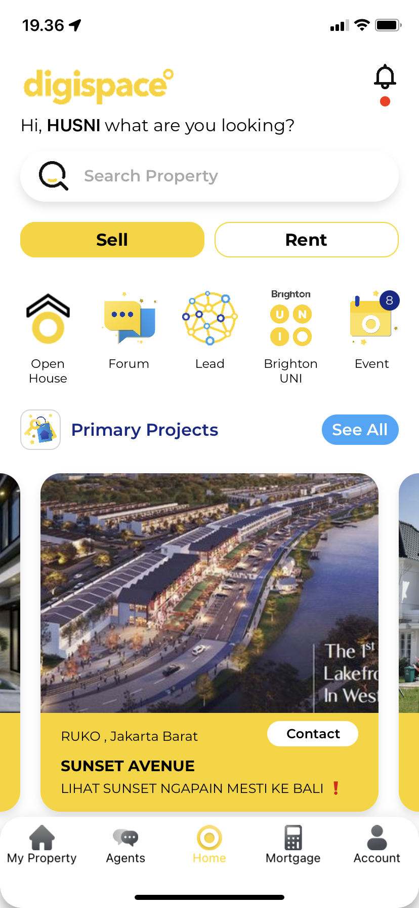
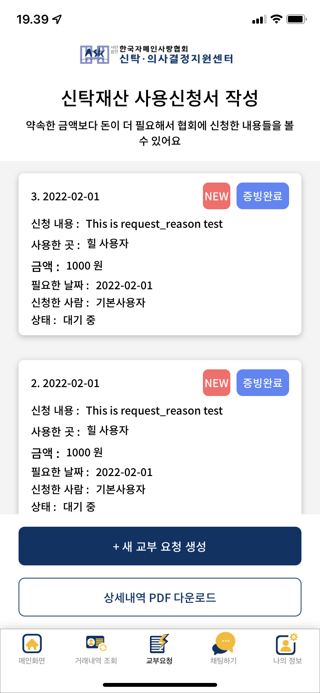

# Fumi
Fumi is a period cycle tracker app with a pretty pinky UI that helps you go through your PMS.

Fumi is my first app created by a well-organized team on my intern at Apple Developer Academy. My role is to make the calendar system function, managing user data with Core Data, and homepage features like cookies, fun facts, and mood cycle.

Repository Link: Not Available  
Publication: Once TestFlighted but not available for now

&nbsp;&nbsp;&nbsp;&nbsp;&nbsp;&nbsp;&nbsp;&nbsp;&nbsp;&nbsp;

# Foundee
Foundee is a lost and found app that helps people find their lost things or get a reward for finding people's things.

Foundee is my second app on my intern at Apple Developer Academy. My role is to make the backend and integrate the API on the apps. I also made the lost and found create post UI.

Repository Link: https://gitlab.com/jeremyendratno/foundee  
Publication: Once TestFlighted but not available for now

&nbsp;&nbsp;&nbsp;&nbsp;&nbsp;

# Wufy
Wufy is a dog training app with fun and interactive UI that helps you track your dog needs and train your dog to be a champion.

Wufy is the last and best app that i and my team made on my intern at Apple Developer Academy, we managed to get Wufy to publish on AppStore. My Role is to make the dog character movement and animation with SpriteKit. Also the daily walk page UI and function logic with CoreMotion.

Repository Link: Not Available  
Publication: https://apps.apple.com/id/app/wufy-dog-training/id1535423130

&nbsp;&nbsp;&nbsp;&nbsp;&nbsp;&nbsp;&nbsp;&nbsp;&nbsp;&nbsp;

# Cooking Book Recipes
Cooking Book Recipes is a recipes app that helps you cook by providing recipes that can be presented without touching the phone.

Cooking Book Recipes was my first solo project app that made to fulfill my final exam at university. Cooking Book Recipes was made with Voice Recognition, Natural Language Processing, and Speech Synthesis. These technologies were integrated to give the user the best experience to interact with the app without touching the phone and using only voice commands.

Repository Link: https://gitlab.com/jeremyendratno/5ThingsTugasAkhir  
Publication: Once TestFlighted but not available for now

&nbsp;&nbsp;&nbsp;&nbsp;&nbsp;

# PretHome
PretHome is an IoT integrated apps that control my home's gate from iOS.

PretHome is a solo project app that is made just for fun learning IoT. This app is a remote to control my home's gate online by giving information to Arudino that is implemented on the gate. So we can open the gate anywhere across the world with just one button on the app.

Repository Link: https://gitlab.com/jeremyendratno/PretHome  
Publication: Not available

&nbsp;&nbsp;&nbsp;&nbsp;&nbsp;&nbsp;&nbsp;&nbsp;&nbsp;&nbsp;

# GuessYourWaifu
GuessYourWaifu is a guessing app that lets you be on the top of the scoreboard by guessing some female anime characters.

GuessYourWaifu is a solo project app that is made to learn the integration of Firebase. This app only has some basic functions with Firebase's Database real-time integration for the scoreboard. The scoreboard is like old school retro arcade game, so the user doesn't need to log in.

Repository Link: https://gitlab.com/jeremyendratno/GuessYourWaifu  
Publication: Not Available

&nbsp;&nbsp;&nbsp;&nbsp;&nbsp;

# Medikuy
Medikuy is a medical app that provides you with some useful medical articles and to make an appointment with a doctor that you need.

Medikuy is an app that was made in my intern at Alodokter. My role is to make a home page that includes articles with a search and filter function and an appointment page. I also need to call the API that was provided by the backend team.

Repository Link: https://github.com/Rakamin-Bootcamp-Kelompok-1/alodokter-rakamin-ios-grup1  
Publication: Not Available

&nbsp;&nbsp;&nbsp;&nbsp;&nbsp;&nbsp;&nbsp;&nbsp;&nbsp;&nbsp;

# Stickiz
Stickiz is a text storing apps that can be neatly categorized and be used on the keyboard extension.

Stickiz is a solo project app that was made to learn keyboard extension. This app data is stored in CoreData and shared with keyboard extension by app group. The app is made with UIKit and the keyboard extension made with SwiftUI, both of them were made with simple design.

Repository Link: https://github.com/jeremyendratno/Stickiz  
Publication: Not Available

&nbsp;&nbsp;&nbsp;&nbsp;&nbsp;&nbsp;&nbsp;&nbsp;&nbsp;&nbsp;

# Brighton
Brighton is a real estate agent company that modernize with techonological advancement.

Brighton uses iOS as one of their platform to help agents reach out to their customer. The app help customer to browse around agent's property list and make connection with agent more easy. My role on the app is to optimaze the peformance to run better. Cleaning / refactoring the code to be more easily readable and documentable. Improve the UI to be more user friendly and more clean for better user experience.

Respository Link: Not Available  
Publication: https://apps.apple.com/id/app/brighton-real-estate/id1203280367?l=id

 
&nbsp;&nbsp;&nbsp;&nbsp;&nbsp;&nbsp;&nbsp;&nbsp;&nbsp;&nbsp;

# Bright Staff
Bright Staff is a brighton's staff app to help them with company's needs.

Bright Staff help staff to take their attendance, look at their pay check, look at their shift, and request their paid leave. I made this app from scratch and kept it updated to company needs. This app uses simple UI that is very readable and user friendly. Kept the feature simple and easy to use.

Respository Link: Not Available  
Publication: https://apps.apple.com/id/app/bright-staff/id1603758703

 
&nbsp;&nbsp;&nbsp;&nbsp;&nbsp;&nbsp;&nbsp;&nbsp;&nbsp;&nbsp;

# Autism Love
Autism Love is a property management support service app from Korea.

Autism love is a project from Fusions Visual. A Team from fusion is handling this project, My role on the team is just some simple bug fixing.

Respository Link: Not Available  
Publication: https://apps.apple.com/us/app/my%EC%8B%A0%ED%83%81/id1600216044

 
&nbsp;&nbsp;&nbsp;&nbsp;&nbsp;&nbsp;&nbsp;&nbsp;&nbsp;&nbsp;

# Covid Calendar
Covid Calendar is a calendar feature for lodging app.

Covid Calendar is a project from Fusions Visual. A 2 man project that i worked on with my partner. This app is made fully with SwiftUI to build a functional calendar that take customer date information for lodging.

Respository Link: Not Available  
Publication: Not Available

 
&nbsp;&nbsp;&nbsp;&nbsp;&nbsp;&nbsp;&nbsp;&nbsp;&nbsp;&nbsp;

# 日本語's Journey
日本語's Journey is a japanese language learning app.

日本語's Journey is a personal project that i made to help me study japanese. A very simple app that doesn't use api. Content it provides is mostly from my notebook.

Respository Link: https://gitlab.com/jeremyendratno/jeremy-nihon-go-journey  
Publication: https://testflight.apple.com/join/lOepiy46

 
&nbsp;&nbsp;&nbsp;&nbsp;&nbsp;&nbsp;&nbsp;&nbsp;&nbsp;&nbsp;

