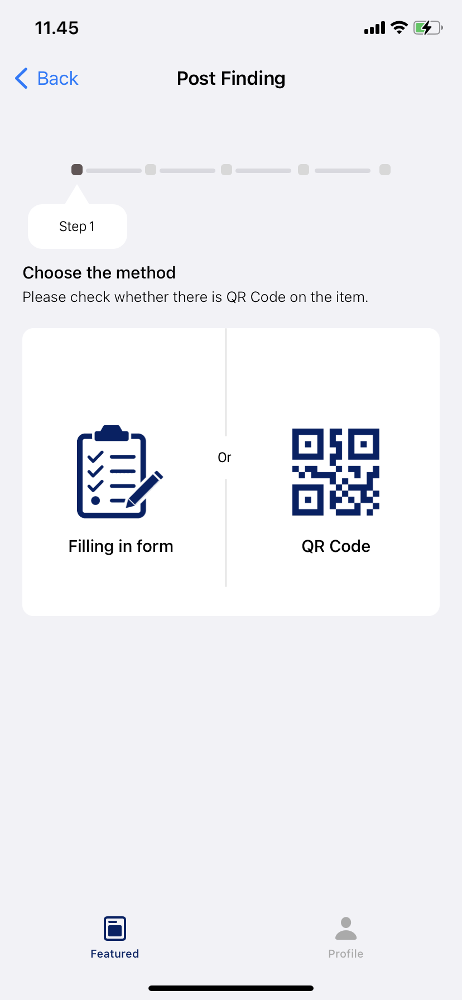
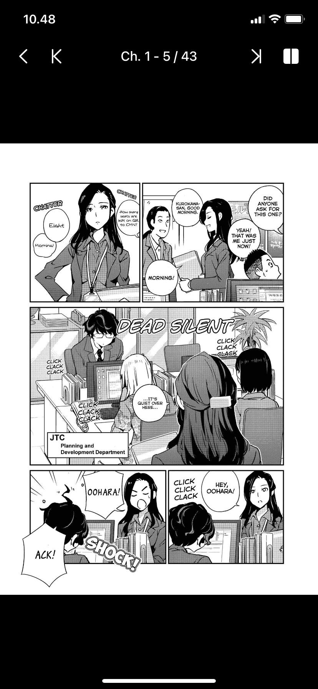

# Fumi
Fumi is a sophisticated period cycle tracker application with an aesthetically pleasing pink-themed user interface, designed to assist users in effectively managing their premenstrual syndrome (PMS) symptoms.

Developed during my tenure as an intern at Apple Developer Academy, Fumi represents my inaugural venture in application development, which was accomplished in collaboration with a highly efficient and coordinated team. In my capacity, I was primarily responsible for implementing the calendar system functionality, leveraging Core Data to proficiently manage user data, and integrating various features on the homepage, including informative snippets such as cookies, interesting facts, and mood cycles.

Repository Link: Not Available  
Publication: Once TestFlighted but not available for now

&nbsp;&nbsp;&nbsp;&nbsp;&nbsp;&nbsp;&nbsp;&nbsp;&nbsp;&nbsp;

# Foundee
Foundee is an innovative lost and found application designed to facilitate the retrieval of lost items and provide a platform for individuals to be rewarded for assisting others in locating their belongings.

During my internship at Apple Developer Academy, I had the opportunity to contribute to the development of Foundee as my second application project. In this capacity, I played a pivotal role in developing the backend infrastructure, ensuring seamless integration with the app through API implementation. Additionally, I designed the user interface for creating lost and found posts, focusing on an intuitive and user-friendly experience to streamline the process of reporting lost items or submitting found items.

Repository Link: https://gitlab.com/jeremyendratno/foundee  
Publication: Once TestFlighted but not available for now

&nbsp;&nbsp;&nbsp;&nbsp;&nbsp;&nbsp;&nbsp;&nbsp;&nbsp;&nbsp;

# Wufy
Wufy is an exceptional dog training application, boasting a captivating and interactive user interface, dedicated to assisting users in tracking their dog's needs and fostering their development into a well-trained champion.

As the culmination of my internship at Apple Developer Academy, Wufy stands as the final and most remarkable app that my team and I successfully developed and published on the App Store. During this project, I undertook a pivotal role in creating the dog character movement and animation utilizing the powerful SpriteKit framework. Moreover, I was responsible for designing the UI and implementing the functional logic for the daily walk page, utilizing CoreMotion to ensure accurate tracking of users' walking activities.

Repository Link: Not Available  
Publication: https://apps.apple.com/id/app/wufy-dog-training/id1535423130

&nbsp;&nbsp;&nbsp;&nbsp;&nbsp;&nbsp;&nbsp;&nbsp;&nbsp;&nbsp;

# Cooking Book Recipes
Cooking Book Recipes is a recipe application designed to enhance the cooking experience by offering a hands-free approach, enabling users to access and navigate recipes solely through voice commands.

Developed as solo project app for my final exam at university, Cooking Book Recipes showcases a seamless integration of cutting-edge technologies, including Voice Recognition, Natural Language Processing, and Speech Synthesis. These advanced components collectively empower users to interact with the app effortlessly, without the need for physical contact with their devices. By leveraging voice commands, users can navigate through recipes, retrieve instructions, and obtain cooking-related information, ensuring a highly immersive and intuitive user experience.

Repository Link: https://gitlab.com/jeremyendratno/5ThingsTugasAkhir  
Publication: Once TestFlighted but not available for now

&nbsp;&nbsp;&nbsp;&nbsp;&nbsp;

# PretHome
PretHome is a cutting-edge iOS application that I developed as a personal project to delve into the realm of Internet of Things (IoT). It serves as a comprehensive control interface for my home's gate, seamlessly integrating with IoT devices.

With PretHome, I embarked on a journey of learning IoT concepts and technologies. This app acts as a remote control, enabling me to operate my home's gate remotely, leveraging the power of the internet. By transmitting instructions to an Arduino device installed on the gate, PretHome allows me to effortlessly open the gate from anywhere in the world using a single button on the application. This project not only showcases my commitment to exploring IoT capabilities but also demonstrates the practical application of IoT in enhancing convenience and accessibility within the realm of home automation.

Repository Link: https://gitlab.com/jeremyendratno/PretHome  
Publication: Not available

&nbsp;&nbsp;&nbsp;&nbsp;&nbsp;&nbsp;&nbsp;&nbsp;&nbsp;&nbsp;

<!-- # GuessYourWaifu
GuessYourWaifu is a guessing app that lets you be on the top of the scoreboard by guessing some female anime characters.

GuessYourWaifu is a personal project that i made to learn the integration of Firebase. This app only has some basic functions with Firebase's Database real-time integration for the scoreboard. The scoreboard is like old school retro arcade game, so the user doesn't need to log in.

Repository Link: https://gitlab.com/jeremyendratno/GuessYourWaifu  
Publication: Not Available

&nbsp;&nbsp;&nbsp;&nbsp;&nbsp;

 -->

# Medikuy
Medikuy is a comprehensive medical application developed during my internship at Alodokter. This app serves as a valuable resource, offering users access to a curated collection of informative medical articles, while also facilitating the process of scheduling appointments with doctors as per their specific needs.

Within this project, my primary responsibility involved designing and implementing the app's homepage. This encompassed creating a user-friendly interface that prominently featured medical articles, complemented by robust search and filter functionality, empowering users to efficiently navigate and explore relevant content. Additionally, I played a crucial role in developing the appointment page, ensuring a seamless user experience for scheduling appointments with doctors. To facilitate data integration and retrieval, I seamlessly integrated the provided backend team's API, enabling real-time information updates and smooth communication between the frontend and backend components of the application.

Repository Link: https://github.com/Rakamin-Bootcamp-Kelompok-1/alodokter-rakamin-ios-grup1  
Publication: Not Available

&nbsp;&nbsp;&nbsp;&nbsp;&nbsp;&nbsp;&nbsp;&nbsp;&nbsp;&nbsp;

# Stickiz
Stickiz is an innovative text storage application designed to provide users with a convenient and organized platform for storing and categorizing their text-based content and displaying within the keyboard extension. This unique feature allows users to access and utilize their stored text conveniently while using any app or engaging in conversations.

To achieve this goal, Stickiz leverages CoreData, a robust data storage framework, to securely store user data. The information is seamlessly shared between the main app and the keyboard extension using an app group, ensuring a synchronized experience across both components. The app itself is built using UIKit, while the keyboard extension is developed using SwiftUI, allowing for a seamless integration of both frameworks.

Repository Link: https://github.com/jeremyendratno/Stickiz  
Publication: Not Available

&nbsp;&nbsp;&nbsp;&nbsp;&nbsp;&nbsp;&nbsp;&nbsp;&nbsp;&nbsp;

# Brighton
Brighton is a forward-thinking real estate agent company that has embraced technological advancements to enhance its operations and services. As part of their strategy, Brighton utilizes iOS as one of their platforms to facilitate effective communication between agents and customers. The accompanying app is designed to streamline the browsing experience for customers, enabling them to explore the property listings and establish connections with agents effortlessly.

Within this project, my role primarily focused on optimizing the performance of the app to ensure smoother operations. This involved cleaning and refactoring the existing codebase to enhance readability and maintainability. By doing so, the code became more comprehensible and easily documented, leading to improved collaboration and long-term maintenance of the application. Additionally, I played a crucial role in improving the app's user interface (UI) to create a more user-friendly and visually appealing experience. This involved implementing design enhancements to promote better usability and a cleaner aesthetic, ultimately contributing to an enhanced user experience (UX). By actively participating in these optimization efforts, I aimed to contribute to Brighton's goal of leveraging technology to modernize its real estate agent services, providing an improved and seamless experience for both agents and customers alike.

Respository Link: Not Available  
Publication: https://apps.apple.com/id/app/brighton-real-estate/id1203280367?l=id

 
&nbsp;&nbsp;&nbsp;&nbsp;&nbsp;&nbsp;&nbsp;&nbsp;&nbsp;&nbsp;

# Bright Staff
Bright Staff is an essential application designed specifically for the staff members of Brighton, providing them with convenient access to various features and fulfilling the company's operational requirements. This comprehensive app simplifies several crucial tasks for staff members. It enables them to easily mark their attendance, view their paychecks, check their assigned shifts, and request paid leave. By centralizing these functionalities within a single platform, Bright Staff streamlines administrative processes and empowers staff members to manage their work-related activities efficiently.

From inception to ongoing maintenance, I developed and continually updated the app to align with the evolving needs of the company. The user interface (UI) of Bright Staff adheres to a principle of simplicity, ensuring readability and user-friendliness. The intuitive design allows staff members to navigate the app effortlessly and perform tasks with ease. By focusing on simplicity and usability, Bright Staff optimizes staff productivity and engagement, serving as an indispensable tool to support the day-to-day operations of Brighton and cater to the needs of its dedicated workforce.

Respository Link: Not Available  
Publication: https://apps.apple.com/id/app/bright-staff/id1603758703

 
&nbsp;&nbsp;&nbsp;&nbsp;&nbsp;&nbsp;&nbsp;&nbsp;&nbsp;&nbsp;

# Autism Love
Autism Love is a property management support service app developed by Fusions Visual, for a Korean company. This project is led and managed by a dedicated team from Fusion. While working on the team, my role primarily involved addressing minor issues and bug fixing within the app.

As a member of the team, my focus was to contribute towards ensuring the smooth functioning and optimal performance of Autism Love. I actively worked on identifying and resolving any software glitches or bugs that were encountered, ensuring that the app maintained its stability and reliability for property management support services. While my role may have been limited to bug fixing, I played a vital part in maintaining the overall quality of the app, ultimately contributing to the success of the Autism Love project led by Fusions Visual.

Respository Link: Not Available  
Publication: https://apps.apple.com/us/app/my%EC%8B%A0%ED%83%81/id1600216044

 
&nbsp;&nbsp;&nbsp;&nbsp;&nbsp;&nbsp;&nbsp;&nbsp;&nbsp;&nbsp;

# Covid Calendar
Covid Calendar is a calendar feature developed by Fusions Visual for a lodging app. This particular project was a collaborative effort between myself and a partner, where we worked as a two-person team.

The main objective of Covid Calendar was to create a functional and user-friendly calendar component specifically tailored for lodging purposes. To achieve this, we utilized SwiftUI, Apple's modern framework for building user interfaces across all Apple platforms. Using SwiftUI, we crafted a visually appealing and intuitive calendar interface that seamlessly integrated with the lodging app. The calendar feature allowed customers to input and select dates relevant to their lodging needs, providing a convenient way to manage their reservations.

Respository Link: Not Available  
Publication: Not Available

 
&nbsp;&nbsp;&nbsp;&nbsp;&nbsp;&nbsp;&nbsp;&nbsp;&nbsp;&nbsp;

# 日本語's Journey
日本語's Journey is a simple app that I created solely for my own Japanese language studies. It does not rely on any APIs for its content, which mainly consists of information compiled from my personal notebook. The app was built without utilizing any external tools or libraries.

This app focuses on providing fundamental Japanese language learning materials, including grammar rules, vocabulary, and expressions. Users can access and browse through the learning content based on the notes I have compiled, enabling them to engage in self-directed study. While 日本語's Journey was initially developed to support my own language learning journey, I hope that it can also be of value to other Japanese language learners. The app features a simple yet user-friendly design, aiming to create an environment where users can effectively learn Japanese.

Respository Link: https://gitlab.com/jeremyendratno/jeremy-nihon-go-journey  
Publication: https://testflight.apple.com/join/lOepiy46

 
&nbsp;&nbsp;&nbsp;&nbsp;&nbsp;&nbsp;&nbsp;&nbsp;&nbsp;&nbsp;

# KoronMangaDex
KoronMangaDex is a manga reading app designed to provide a comfortable manga reading experience directly from a dedicated mobile application, eliminating the need to rely on web browsers. This personal project was developed with the goal of enhancing the accessibility and convenience of reading manga through a user-friendly app interface.

To achieve this, KoronMangaDex leverages the MangaDex API to fetch and display manga content. The app follows the MVVM (Model-View-ViewModel) architecture, ensuring a clean and maintainable codebase that separates the presentation logic from the underlying data. This design pattern allows for easier maintenance, testing, and future enhancements of the app. One notable aspect of KoronMangaDex is its smooth reading experience, achieved through a custom collection view implementation. By building the reading functionality from scratch, the app avoids reliance on external libraries, resulting in a streamlined and lightweight reading experience. While KoronMangaDex is a personal project, efforts are underway to prepare for its publication on the App Store. This includes studying and adhering to the terms and conditions for API usage to ensure compliance before submitting the app for review and potential publication. Once available, KoronMangaDex aims to provide manga enthusiasts with a seamless and immersive manga reading experience on their mobile devices, offering a convenient alternative to browsing manga through web browsers.

Respository Link: Not Available  
Publication: https://testflight.apple.com/join/Y4RVtzeb

 
&nbsp;&nbsp;&nbsp;&nbsp;&nbsp;&nbsp;&nbsp;&nbsp;&nbsp;&nbsp;

# kNihongo
kNihongo is an innovative Japanese vocabulary learning app developed as a personal project, focused on enhancing users' knowledge of kanji and vocabulary. The app utilizes Wanikani's API, a well-known resource in Japanese language learning, to provide comprehensive learning materials.

With a strong emphasis on clean and user-friendly design, kNihongo draws inspiration from the aesthetics of the Wanikani website. The intuitive interface ensures a seamless learning experience, allowing users to navigate and engage with the content effortlessly. One standout feature of kNihongo is the writing practice module, which enables users to practice their kanji writing skills. This functionality utilizes Apple's vision library to detect and analyze handwritten characters, providing real-time feedback and evaluation. By leveraging Wanikani's extensive database and incorporating advanced technologies like handwriting detection, kNihongo empowers users to develop a deeper understanding of Japanese kanji and vocabulary in an engaging and interactive manner. Through kNihongo, learners can embark on an enriching journey to improve their Japanese language skills, while benefiting from a visually appealing interface and practical tools designed to enhance their learning experience.

Respository Link: Not Available  
Publication: https://testflight.apple.com/join/TrcG7Vab

 
&nbsp;&nbsp;&nbsp;&nbsp;&nbsp;&nbsp;&nbsp;&nbsp;&nbsp;&nbsp;

# BRImerchant
BRImerhant is a comprehensive, one-stop solution designed to address the multifaceted needs of merchants. Rooted in advanced technology and meticulous development, it empowers merchants with tools for transaction monitoring, employee management, settlement report, and many more. Rigorous security testing and compliance checks ensure data protection and industry standards are met. BRImerhant epitomizes cutting-edge technology and unwavering dedication to enhancing the merchant experience, delivering growth, efficiency, and success.

During my tenure at PT Bank Rakyat Indonesia (Persero) Tbk, I led the end-to-end development of the 'BRImerchant' iOS app, overseeing every aspect from initial concept to deployment on the App Store. I efficiently collaborated with cross-functional development team, which included designers, QA testers, and backend developers, ensuring a harmonious and effective development process. Furthermore, I prioritized performance optimization, delivering a seamless user experience. I also ensured robust security by subjecting the app to rigorous security tests, including SAST, Sonarqube, penetration testing, and more, safeguarding sensitive user data. My commitment to maintaining a well-organized and efficient codebase was demonstrated through active participation in version control using Git. Rigorous testing, timely bug resolution, and performance enhancements were key in ensuring top-tier app quality. To foster a collaborative and transparent work environment, I effectively communicated project progress and updates to the team and stakeholders.

Respository Link: Not Available  
Publication: https://apps.apple.com/id/app/brimerchant/id6450663459

 
&nbsp;&nbsp;&nbsp;&nbsp;&nbsp;&nbsp;&nbsp;&nbsp;&nbsp;&nbsp;

